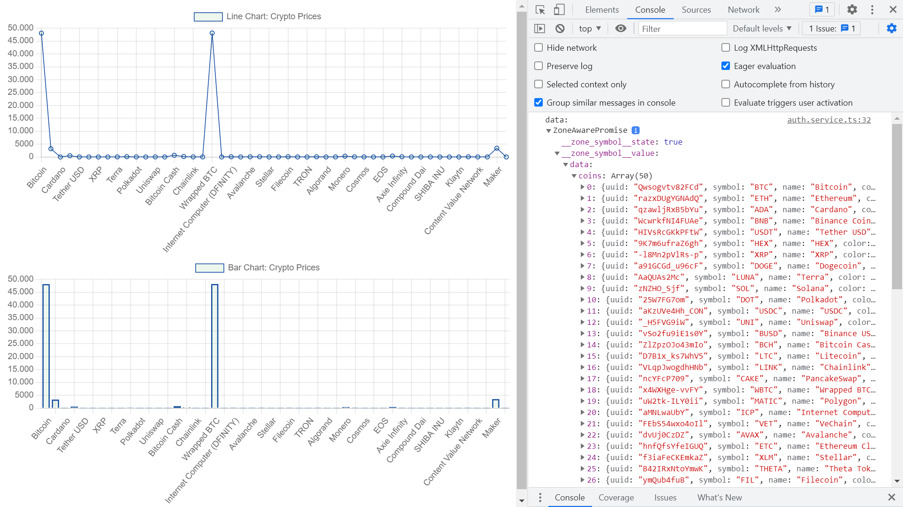

# :zap: Angular Charts Data

* Angular app using [Chart.js](https://www.chartjs.org/) to display [free Coinranking API](https://developers.coinranking.com/api/documentation) data
* Tutorial code from [The Code Angle](https://www.youtube.com/channel/UChi_aILZkMMx8_KlVAsbI7g) with additional chart and some other code changes
* **Note:** to open web links in a new window use: _ctrl+click on link_


## :page_facing_up: Table of contents

* [Angular charts Data](#angular-charts-data)
  * [:page_facing_up: Table of contents](#page_facing_up-table-of-contents)
  * [:books: General info](#books-general-info)
  * [:camera: Screenshots](#camera-screenshots)
  * [:signal_strength: Technologies](#signal_strength-technologies)
  * [:floppy_disk: Setup](#floppy_disk-setup)
  * [:computer: Code Examples](#computer-code-examples)
  * [:cool: Features](#cool-features)
  * [:clipboard: Status & To-Do List](#clipboard-status--to-do-list)
  * [:clap: Inspiration](#clap-inspiration)
  * [:file_folder: License](#file_folder-license)
  * [:envelope: Contact](#envelope-contact)

## :books: General info

* To get temporary access to the CORS proxy url it is necessary to click a request button at `https://cors-anywhere.herokuapp.com/corsdemo`
* Chart types: ArcElement, LineElement, BarElement, PointElement, BarController, BubbleController, DoughnutController, LineController, PieController, PolarAreaController, RadarController, ScatterController,  CategoryScale, LinearScale, LogarithmicScale, RadialLinearScale, TimeScale, TimeSeriesScale, Decimation, Filler,  Legend, Title, Tooltip, SubTitle
* `toPromise` used; a constructor that resolves to ZoneAwarePromise() from zone.js at run time in the browser.

## :camera: Screenshots



## :signal_strength: Technologies

* [Angular framework v13](https://angular.io/)
* [RxJS v7](https://rxjs.dev/) Reactive Extensions Library for JavaScript
* [Chart.js v3](https://www.chartjs.org/docs/latest/) - latest version 3.6 resolves Canvas Rendering Error (see StackOverflow answer in Inspiration below)
* [Coinranking API v2](https://developers.coinranking.com/api/documentation) for free cryptocurrency data
* [CORS anywhere](https://cors-anywhere.herokuapp.com/) to get round Cross-Origin limitations with localhost

## :floppy_disk: Setup

* Run `npm i` to install dependencies
* Create an account & get a Developers API key from [Coinranking](https://developers.coinranking.com/)
* Add API key to `services\authService`
* Enables temporary CORS issue workaround via `https://cors-anywhere.herokuapp.com/corsdemo`
* Run `ng serve` for a dev server. Navigate to `http://localhost:4200/`. The app will automatically reload if you change any of the source files.
* Run 'ng build' to create a build file

## :computer: Code Examples

* extract from `app.component.ts` to create chart2 data

```typescript
this.chart2 = new Chart('canvas2', {
  type: 'bar',
  data: {
    labels: this.coinName,
    datasets: [
      {
        data: this.coinPrice,
        borderColor: '#0d47a1',
        label: 'Bar Chart: Crypto Prices',
        backgroundColor: 'rgba(93, 175, 89, 0.1)',
        borderWidth: 1,
      },
    ],
  },
});
```

## :cool: Features

* [Charts.js](https://www.chartjs.org/docs/latest/) has other types of charts and lots of options that can be configured.

## :clipboard: Status & To-Do List

* Status: Working
* To-Do: Could add data types to replace 'any'

## :clap: Inspiration

* [The Code Angle, How to Integrate Chart.js Using Angular 12 with Data from a REST API (2021)](https://www.youtube.com/watch?v=WCI4yvrzFwc)
* [Angular Chartjs error TS2304: Cannot find name OffscreenCanvasRenderingContext2D](https://stackoverflow.com/questions/68209426/angular-chartjs-error-ts2304-cannot-find-name-offscreencanvasrenderingcontext2d)

## :file_folder: License

* N/A

## :envelope: Contact

* Repo created by [ABateman](https://github.com/AndrewJBateman), email: gomezbateman@yahoo.com
